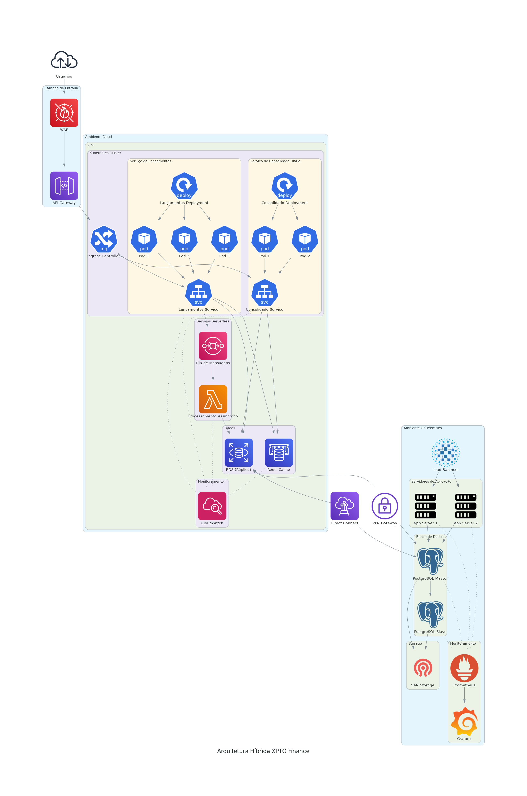

# Arquitetura Proposta

## Visão Geral

A arquitetura proposta para a XPTO Finance consiste em uma solução híbrida que integra o ambiente on-premises existente com uma infraestrutura em nuvem, garantindo alta disponibilidade, segurança, otimização de custos e automação.

## Diagrama de Topologia

O diagrama acima ilustra a solução completa, abrangendo desde a infraestrutura on-premises até a integração com a nuvem.

## Componentes Arquiteturais

### Ambiente On-Premises

#### Servidores de Aplicação
- **Servidores Legados**: Mantidos para garantir a continuidade dos serviços durante a transição
- **Load Balancer (HAProxy)**: Distribui o tráfego entre os servidores de aplicação, garantindo alta disponibilidade
- **Firewall de Borda**: Protege o perímetro da rede on-premises

#### Banco de Dados
- **PostgreSQL Master**: Banco de dados principal para transações financeiras
- **PostgreSQL Slave**: Réplica para alta disponibilidade e distribuição de leitura
- **SAN Storage**: Armazenamento centralizado para dados críticos

#### Monitoramento
- **Prometheus**: Coleta de métricas de infraestrutura e aplicações
- **Grafana**: Visualização de métricas e alertas

#### Conectividade
- **VPN Gateway**: Estabelece conexão segura com o ambiente cloud
- **Direct Connect (opcional)**: Conexão dedicada para baixa latência e alta performance

### Ambiente Cloud

#### Kubernetes Cluster
- **Serviço de Lançamentos Financeiros**: Deployments com múltiplas réplicas para alta disponibilidade
- **Serviço de Consolidado Diário**: Deployments com autoscaling para lidar com picos de demanda
- **Ingress Controller**: Gerencia o tráfego de entrada para os serviços

#### Serviços Serverless
- **Funções Lambda**: Processamento assíncrono de eventos
- **Filas SQS**: Garantem processamento resiliente de mensagens

#### Banco de Dados e Cache
- **RDS (Réplica)**: Réplica de leitura do banco on-premises
- **Redis Cache**: Otimização de performance com caching distribuído

#### API Gateway e Segurança
- **API Gateway**: Gerenciamento centralizado de APIs
- **WAF (Web Application Firewall)**: Proteção contra ataques web
- **VPN Gateway**: Conexão segura com ambiente on-premises

#### Monitoramento
- **CloudWatch**: Monitoramento de recursos cloud
- **Logs Centralizados**: Coleta e análise de logs de todos os componentes

## Fluxo de Rede

### Fluxo de Usuários para Serviços
1. Os usuários acessam os serviços através da internet
2. O tráfego passa pelo WAF para proteção contra ataques
3. O API Gateway roteia as requisições para os serviços apropriados
4. O Ingress Controller no Kubernetes direciona o tráfego para os pods corretos
5. Os serviços processam as requisições e retornam as respostas

### Fluxo de Dados entre Ambientes
1. A VPN/Direct Connect estabelece um túnel seguro entre os ambientes
2. O banco de dados on-premises replica dados para a réplica RDS na nuvem
3. Os serviços na nuvem consultam a réplica RDS para operações de leitura
4. Operações de escrita são encaminhadas para o banco de dados on-premises
5. O cache Redis armazena dados frequentemente acessados para reduzir latência

### Fluxo de Processamento Assíncrono
1. Os serviços enviam mensagens para filas SQS
2. Funções Lambda processam as mensagens assincronamente
3. Os resultados são armazenados no banco de dados
4. Notificações são enviadas aos interessados quando necessário

## Decisões Arquiteturais

### Abordagem Híbrida
A escolha de uma arquitetura híbrida permite:
- Aproveitar os investimentos existentes em infraestrutura on-premises
- Migrar gradualmente para a nuvem, reduzindo riscos
- Manter dados críticos no ambiente controlado on-premises
- Utilizar a escalabilidade e elasticidade da nuvem para novos serviços

### Kubernetes para Orquestração de Containers
O Kubernetes foi escolhido para:
- Gerenciar a implantação e escalabilidade dos serviços
- Garantir alta disponibilidade através de múltiplas réplicas
- Facilitar a recuperação automática em caso de falhas
- Permitir atualizações sem downtime (rolling updates)

### Serverless para Processamento Assíncrono
A abordagem serverless foi adotada para:
- Reduzir custos com processamento sob demanda
- Escalar automaticamente conforme a carga
- Simplificar a manutenção e operação
- Processar picos de demanda sem provisionar recursos permanentes

### Redis para Cache Distribuído
O Redis foi escolhido para:
- Reduzir a carga no banco de dados
- Melhorar o tempo de resposta para dados frequentemente acessados
- Armazenar sessões e dados temporários
- Implementar filas e pub/sub para comunicação entre serviços

### PostgreSQL para Banco de Dados
O PostgreSQL foi selecionado por:
- Ser open source, reduzindo custos de licenciamento
- Oferecer recursos avançados para transações financeiras
- Suportar replicação para alta disponibilidade
- Ter compatibilidade com ambientes on-premises e cloud

## Evoluções Futuras

### Migração Completa para Cloud
- Migração gradual de todos os serviços para a nuvem
- Adoção de arquitetura multi-cloud para evitar vendor lock-in
- Implementação de estratégias de DR entre regiões

### Arquitetura de Microsserviços
- Decomposição dos serviços monolíticos em microsserviços
- Adoção de padrões como API Gateway, Circuit Breaker, e Service Mesh
- Implementação de CI/CD para cada microsserviço

### Inteligência Artificial e Machine Learning
- Previsão de demanda para otimização de recursos
- Detecção de fraudes em transações financeiras
- Análise preditiva para manutenção preventiva

### Zero Trust Security
- Implementação de autenticação e autorização para todas as comunicações
- Microsegmentação de rede
- Criptografia end-to-end para todos os dados
